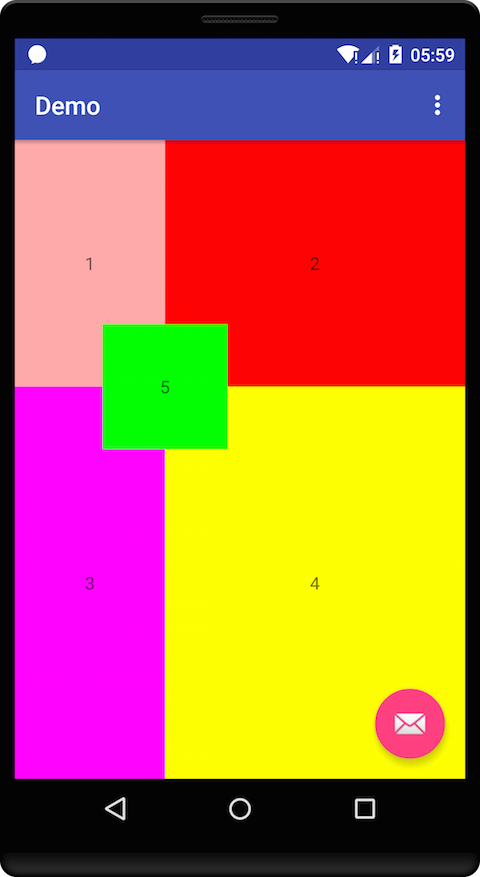

# AndroidSizeUtil
---

## Desc
AndroidSizeUtil is use android mvvm(databinding) architecture.
It is easy to compose layout, like html. Use percentage or expression in xml file to compose layout.

## Usage

### #1
Your app project must use android  mvvm(databinding) architecture. 
[Android mvvm doc](https://developer.android.com/tools/data-binding/guide.html)

### #2
Gradle compile
```
repositories {
    maven {
        url "https://raw.githubusercontent.com/LiushuiXiaoxia/AndroidSizeUtil/master/repo/"
    }
}
compile 'cn.mycommons:androidsizeutil:1.0.0'
```

### #3
Init AndroidSizeUtil in android Application or Activity.

```
public class AppContext extends Application {

    @Override
    public void onCreate() {
        super.onCreate();

        AndroidSizeUtil.init(this);
    }
}
```

### #4
Improt AndroidSizeUtil in xml.
```
<?xml version="1.0" encoding="utf-8"?>
<layout xmlns:android="http://schemas.android.com/apk/res/android"
    xmlns:app="http://schemas.android.com/apk/res-auto"

    xmlns:tools="http://schemas.android.com/tools">

    <data>

        <variable
            name="dimen"
            type="cn.mycommons.androidsizeutil.DimenUtil" />
    </data>
</layout>
```

### #5
Use dimen to compose view or layout like this.
```
<TextView
    android:layout_width="wrap_content"
    android:layout_height="wrap_content"
    app:layout_height="@{dimen.csh/3}"
    app:layout_marginLeft="@{dimen.csw/3}"
    app:layout_marginTop="@{0}"
    app:layout_width="@{dimen.csw*2/3}" />
```
### #6
Use databind in activity.
ContentMainBinding is generate java file by android databinding.
```
public class MainActivity extends AppCompatActivity {

    @Override
    protected void onCreate(Bundle savedInstanceState) {
        super.onCreate(savedInstanceState);
        setContentView(R.layout.activity_main);
        
        ContentMainBinding.bind(findViewById(R.id.content_main)).setDimen(AndroidSizeUtil.newDimenUtil());
    }
}
```


## Api

Attributes set width, height, paddding, margin. The unit is px.
```
app:layout_width // set view width
app:layout_height // set view height

android:paddingLeft // set view paddingLeft
android:paddingRight // set view paddingRight
android:paddingTop // set view paddingTop
android:paddingBottom // set view paddingBottom

app:paddingLeft // set view paddingLeft
app:paddingRight // set view paddingRight
app:paddingTop // set view paddingTop
app:paddingBottom // set view paddingBottom


android:layout_marginLeft // set view layout_marginLeft
android:layout_marginRight // set view layout_marginRight
android:layout_marginTop // set view layout_marginTop
android:layout_marginBottom // set view layout_marginBottom

app:layout_marginLeft // set view layout_marginLeft
app:layout_marginRight // set view layout_marginRight
app:layout_marginTop // set view layout_marginTop
app:layout_marginBottom // set view layout_marginBottom
```

Expression to set size.
```
// 100% screen width
app:layout_width="@{dimen.sw}"
app:layout_width="@{dimen.screenWidth}"


// 1/2 screen height
app:layout_height="@{dimen.sh/2}"
app:layout_height="@{dimen.screenHeight/2}"

// 100px
app:layout_width="@{100}"
app:layout_width="@{dimen.px(100)}"

// 100dp
app:layout_width="@{dimen.dp(100)}"


// 100dp - 10px
app:layout_width="@{dimen.dp(100)-10}"
```

Set view or layout size.
```
// 100dp * 100dp
app:size="@{dimen.sizeDp(100,100)}"

// 100px * 100px
app:size="@{dimen.size(100,100)}"


// 100dp * 100px
app:size="@{dimen.size(dimen.dp(100),100)}"


// screenWidth * 100px
app:size="@{dimen.size(dimen.screenWidth,100)}"
```

## Demo
```
<?xml version="1.0" encoding="utf-8"?>
<layout xmlns:android="http://schemas.android.com/apk/res/android"
    xmlns:app="http://schemas.android.com/apk/res-auto"

    xmlns:tools="http://schemas.android.com/tools">

    <data>

        <variable
            name="dimen"
            type="cn.mycommons.androidsizeutil.DimenUtil" />
    </data>

    <RelativeLayout
        android:id="@+id/content_main"
        android:layout_width="match_parent"
        android:layout_height="match_parent"
        android:orientation="vertical"
        app:layout_behavior="@string/appbar_scrolling_view_behavior"
        tools:context=".MainActivity"
        tools:showIn="@layout/activity_main">

        <TextView
            android:layout_width="wrap_content"
            android:layout_height="wrap_content"
            android:background="#faa"
            android:gravity="center"
            android:text="1"
            app:size="@{dimen.size(dimen.csw/3,dimen.csh/3)}" />

        <TextView
            android:layout_width="wrap_content"
            android:layout_height="wrap_content"
            android:background="#f00"
            android:gravity="center"
            android:text="2"
            app:layout_height="@{dimen.csh/3}"
            app:layout_marginLeft="@{dimen.csw/3}"
            app:layout_marginTop="@{0}"
            app:layout_width="@{dimen.csw*2/3}" />

        <TextView
            android:layout_width="wrap_content"
            android:layout_height="wrap_content"
            android:background="#f0f"
            android:gravity="center"
            android:text="3"
            app:layout_height="@{dimen.csh*2/3}"
            app:layout_marginLeft="@{0}"
            app:layout_marginTop="@{dimen.csh/3}"
            app:layout_width="@{dimen.csw/3}" />

        <TextView
            android:layout_width="wrap_content"
            android:layout_height="wrap_content"
            android:background="#ff0"
            android:gravity="center"
            android:text="4"
            app:layout_height="@{dimen.csh*2/3}"
            app:layout_marginLeft="@{dimen.csw/3}"
            app:layout_marginTop="@{dimen.csh/3}"
            app:layout_width="@{dimen.csw*2/3}" />

        <TextView
            android:layout_width="wrap_content"
            android:layout_height="wrap_content"
            android:background="#0f0"
            android:gravity="center"
            android:text="5"
            app:layout_marginLeft="@{dimen.csw/3-dimen.dp(50)}"
            app:layout_marginTop="@{dimen.csh/3-dimen.dp(50)}"
            app:size="@{dimen.sizeDp(100,100)}" />
    </RelativeLayout>
</layout>

```

## Gradle
```
repositories {
    maven {
        url "https://raw.githubusercontent.com/LiushuiXiaoxia/AndroidSizeUtil/master/repo/"
    }
}

compile 'cn.mycommons:androidsizeutil:1.0.0'
```